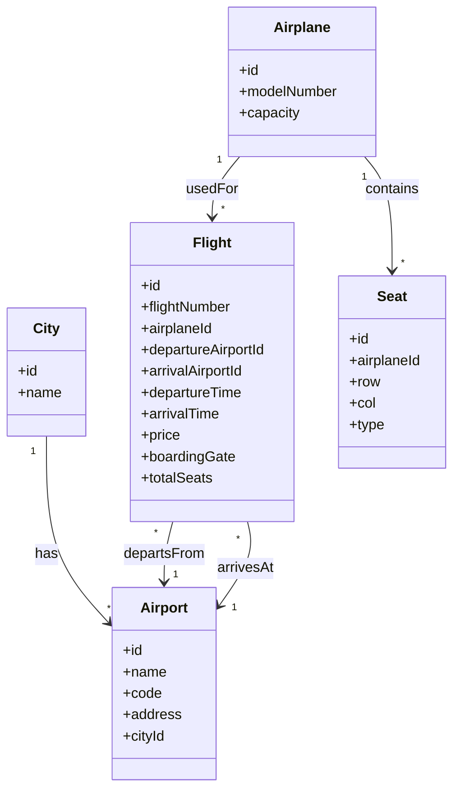

# Airline Booking – Service-Based Node.js Template

This project follows a modular service structure.  
Each service runs independently and manages its own dependencies.

---

## Project Structure

```
services/
  ├── airline-service/
  └── airline-booking-service/
```

Each service contains its own:

- src/
- package.json
- .env
- node_modules

---

## Inside a Service (src structure)

```
src/
  ├── config/
  ├── routes/
  ├── controllers/
  ├── middlewares/
  ├── services/
  ├── repositories/
  ├── models/
  ├── migrations/
  ├── seeders/
  ├── utils/
  └── index.js
```

### Folder Overview

- config/  
  Handles environment setup, server configuration, logging, and database configuration.

- routes/  
  Defines API routes and connects them to controllers.

- middlewares/  
  Request validation and preprocessing logic.

- controllers/  
  Receives requests, calls service layer, and sends structured responses.

- services/  
  Contains business logic and interacts with repositories.

- repositories/  
  Handles database queries (ORM or raw queries).

- models/  
  Database models.

- migrations/  
  Database schema changes.

- seeders/  
  Initial database data.

- utils/  
  Helper functions and shared utilities.

---

---

## 🗄 Database UML Diagram



---

## Setup Instructions

### 1. Install Dependencies

Go inside the service you want to run:

```
cd services/airline-service
npm install
```

---

### 2. Create .env File

Inside the service folder, create a `.env` file:

```
PORT=3000
```

Use any available port.

---

### 3. Initialize Sequelize (if required)

From inside the service folder:

```
npx sequelize init
```

Update `config/config.json` with your database credentials:

- username
- password
- database name
- dialect (mysql, mariadb, etc.)

---

### 4. Run the Service

```
npm run dev
```

If running multiple services, make sure each one uses a different port.